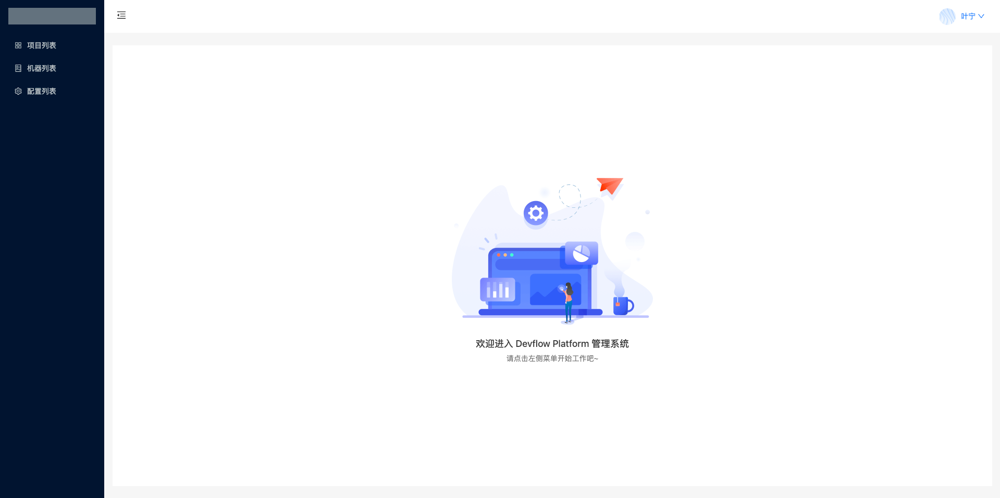
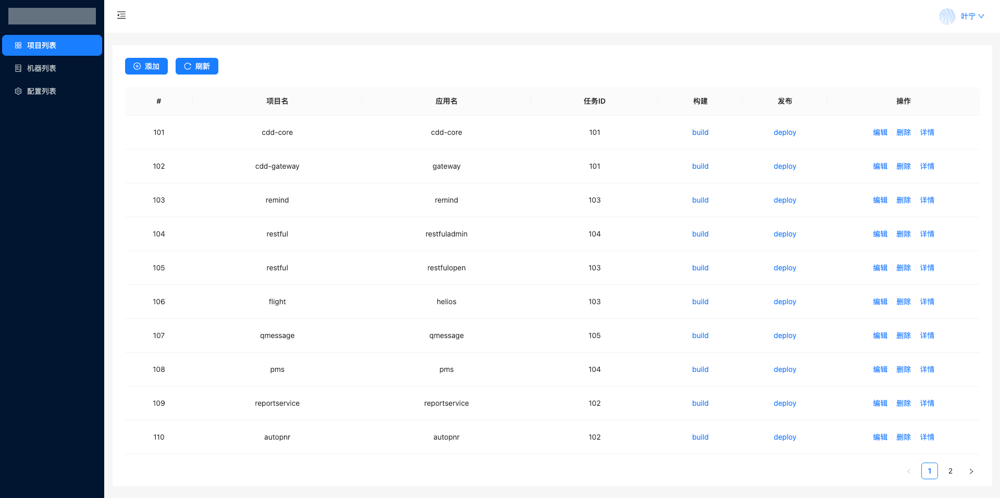
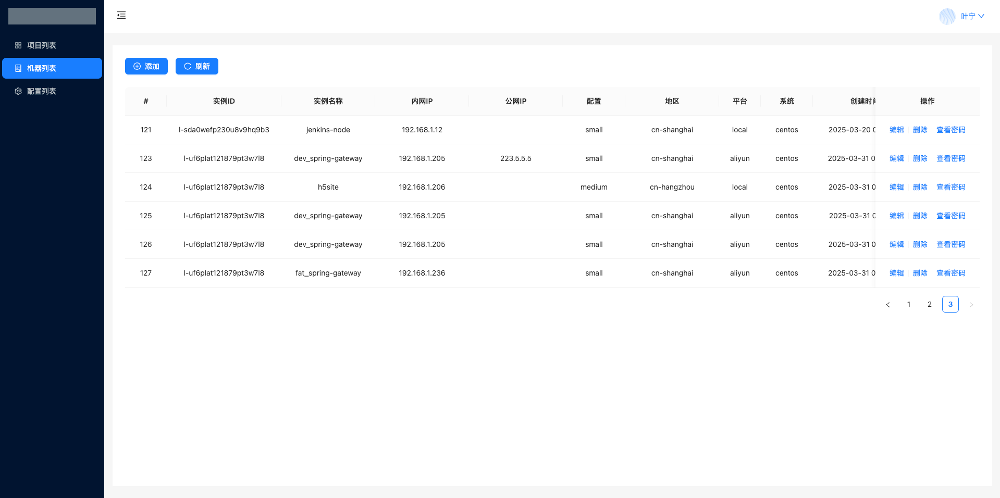
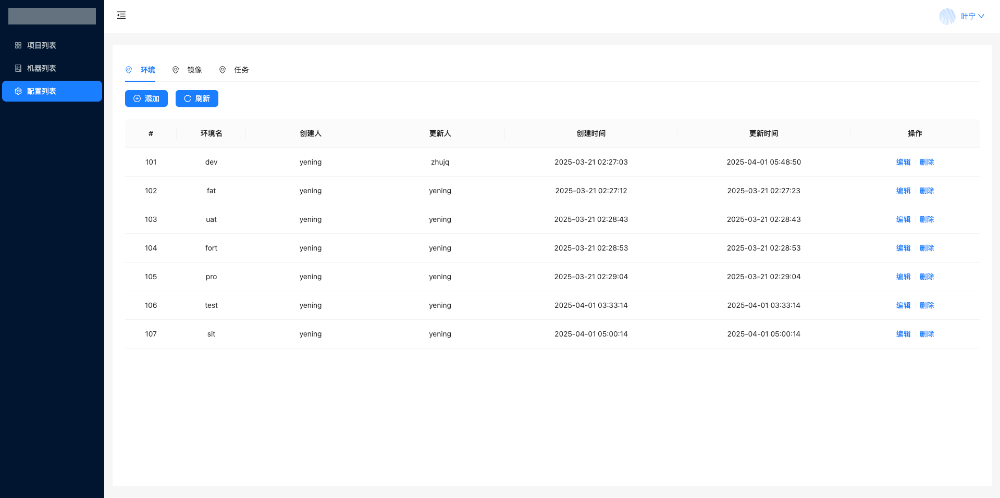
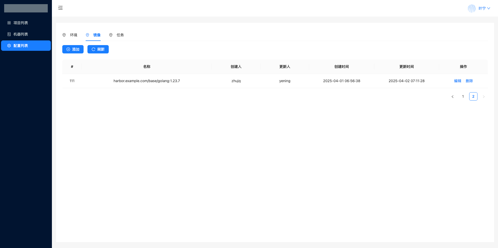
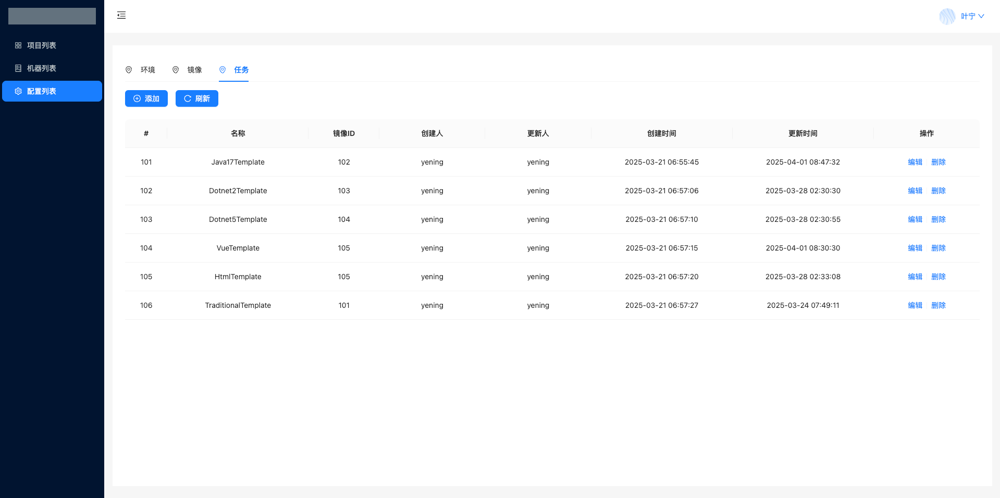
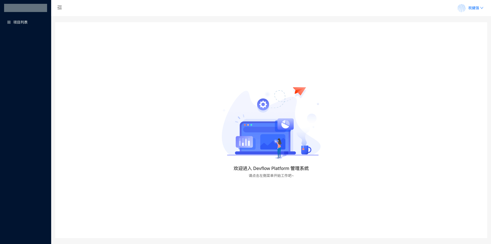
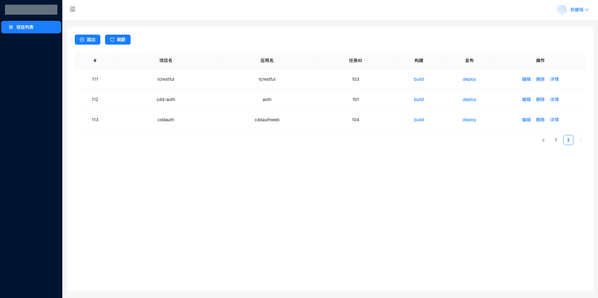

# devflow-web
pure version
## Project setup
```
npm install
```

### Compiles and hot-reloads for development
```
npm run serve
```

### Compiles and minifies for production
```
npm run build
```

## Demo

### Owner 

#### Dashboard List page


#### Project List Page


#### Vm List Page


#### Env List Page


#### Image List Page


#### Task List Page


### Maintainer

#### Dashboard List page


#### Project List Page
